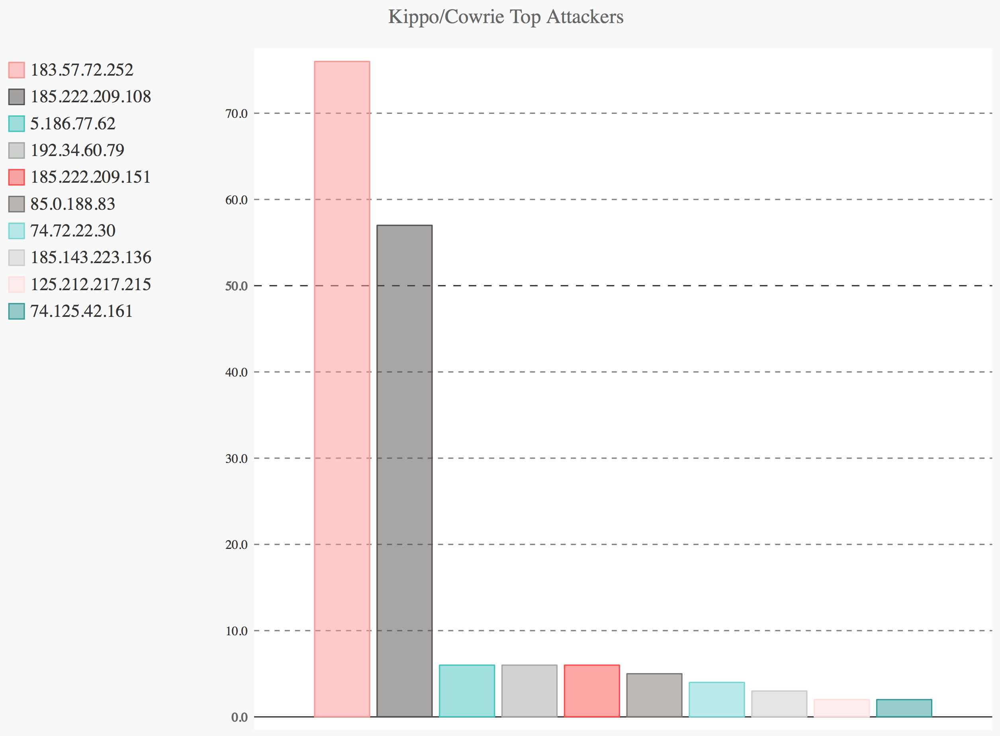
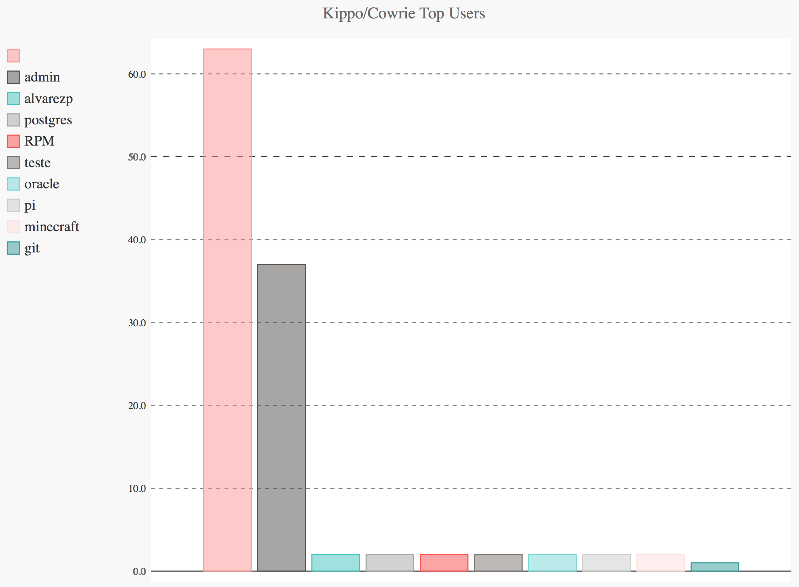
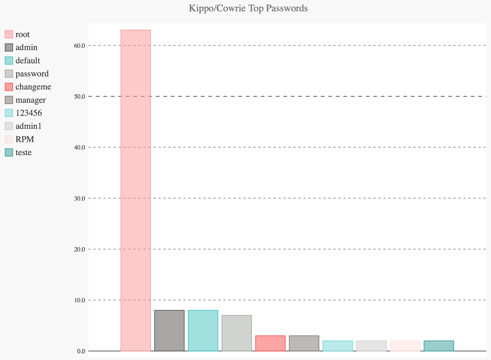
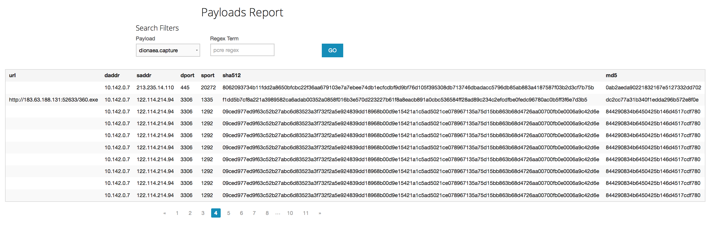

# Project 9 - Honeypot

Time spent: **15** hours spent in total

> Objective: Set up a honeypot and intercept some attempted attacks in the wild.  


## Modern Honeypot Network (MHN)

MHN is a centralized server for management and data collection of honeypots. MHN allows you to deploy sensors quickly and to collect data immediately, viewable from a neat web interface. [[1](https://github.com/threatstream/mhn)].


## Honeypots

These are the honeypots I deployed:  

1. **Conpot**: Conpot is a low interactive server side Industrial Control Systems (ICS) honeypot designed to be easy to deploy, modify and extend [[2](https://github.com/threatstream/mhn/wiki/Conpot-Sensor)]. I deployed a single instance of this honeypot to a virtual machine hosted in the Google Cloud Platform.  
2. **Cowrie**: Cowrie is a medium interaction SSH and Telnet honeypot designed to log brute force attacks and the shell interaction performed by the attacker [[3](https://github.com/threatstream/mhn/wiki/Cowrie-Sensor)]. I deployed a single instance of this honeypot to a virtual machine hosted in the Google Cloud Platform.  
3. **Dionaea**: Dionaea is a honeypot which traps malware exploiting vulnerabilities exposed by services offered to a network with the ultimate goal of gaining a copy of the malware [[4](https://github.com/threatstream/mhn/wiki/Dionaea-Sensor)]. I deployed three instances of this honeypot to three different virtual machines hosted in the Google Cloud Platform. See the *challenges* section below for an explanation of why I did this.  


## Challenges  

As mentioned before, the goal of the Dionaea honeypot is to obtain copies of malware attacking the server. But, a couple of days after I set up the first instance (Ubuntu - Dionaea with HTTP), the honeypot did not catch anything. So, I decided to deploy a second instance (Ubuntu 14.04/CentOS 7 - Dionaea). After some time, I noticed that this honeypot was not capturing any malware either. Intrigued by this, I searched online and found an [issue](https://github.com/threatstream/mhn/issues/417) raised in the MHN Github page. According to many users, Dionaea, when deployed through the scripts provided by MHN, shows no payloads. In the same page, however, I found the solution. One user suggested that manually installing and linking Dionaea to MHN fixes the problem. So, once again, I searched online and found this [guide](https://www.attacusatlas.com/how-to-set-up-dionaea-honeypot-with-modern-honey-network-and-slack-alerts/). I simply followed the directions given there, and the results were surprising; the new Dionaea honeypot captured about thirty different copies of malware in twelve hours! (see *Data Collected* section below) 


### Data Collected 

The following tables showcase statistics provided by MHN in the admin page.

*Table 1 - Sensors*

| Honeypot | UUID | Attacks |
|:--------:|:----:|:-------:|
| conpot | 7fb1f8bc-4698-11e8-91c8-94c6911037e2 | 282 |
| cowrie | 74f228fc-4693-11e8-91c8-94c6911037e2 | 212 |
| (1) dionaea | 6a00e394-4692-11e8-91c8-94c6911037e2 | 10878 |
| (2) dionaea | 5aaf385c-491a-11e8-91c8-94c6911037e2 | 1671 |
| (3) dionaea | 09a28b60-4921-11e8-91c8-94c6911037e2 | 1127 |


*Table 2 - Top 5 attacker IPs*

| No. | IP | Location | Attacks |
|:---:|:--:|:--------:|:-------:|
| 1 | 5.62.63.183 | Tor network | 680 |
| 2 | 74.72.22.30 | U.S | 574 |
| 3 | 122.114.214.94 | China | 117 |
| 4 | 5.188.11.91 | Russia | 104 |
| 5 | 181.214.87.34 | U.S | 103 |


*Table 3 - Top 5 attacked ports*

| No. | Port | Attacks |
|:---:|:----:|:-------:|
| 1 | 5060 | 931 |
| 2 | 445 | 573 |
| 3 | 3306 | 516 |
| 4 | 23 | 490 |
| 5 | 22 | 129 |

The bar charts below offer a visualization of the data collected by the Cowrie honeypot. They show the top attackers (IP addresses), top users, and top passwords.   







The next screenshot shows the Payloads Report page from MHN admin page. It displays useful information about captured malware.    



And the following screen capture shows the malware (binaries) captured by the Dionaea honeypot, which can be found under ```/opt/dionaea/var/dionaea/binaries```. There are about thirty in such directory.


Lastly, file [session.json](./session.json) contains all the data collected by all honeypots.


## Resources

* [MHN, list of supported sensors](https://github.com/threatstream/mhn/wiki/List-of-Supported-Sensors)
* [Google Cloud Platform documentation](https://cloud.google.com/docs/)

